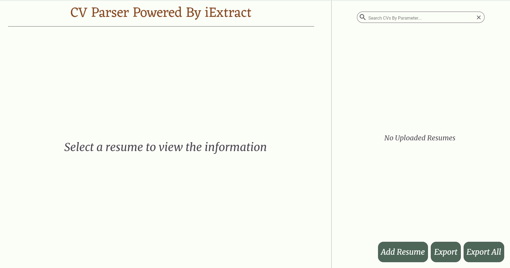

<h1 align="center"> CV-Parser "iExtract"</h1>

Our task was to make a CV parser app, that takes a PDF file that contains some CV and extracts information about the skills, languages etc.

[Demo](#demo) |
[How to use](#use) |
[Features](#features) |
[Project Installation](#installation) |
[Frameworks or technology](#framework) |
[License](#license)

## Description

The [CV parser](https://cv-parser-265d0.firebaseapp.com/#/) helps employers to quickly browse resumes and select the most suitable ones among them. You can download the resumes you want in PDF format from your computer. You can also search for resumes by one or more keywords. You can download resumes in JSON format.
<!-- 

&nbsp; -->

<h2 name="demo">Demo</h2>

<h2 name="use">How to use</h2>

<h2 name="features">Features</h2>

* Upload single or multiple CVs as a PDF file
* Open selected resumes in a special area 
* Search by single or multiple keywords
* Error notification window
* Export single or multiple CVs as JSON files
* Deleting CVs

<h2 name="installation">Installation</h2>

<h2 name="framework">Technology</h2>

<h2 name="lincense">License</h2>
The MIT License (MIT)

Copyright © 2022 [Danila Kuzmin](https://github.com/BikTracker), [Oksana Konovalova](https://github.com/ksko02), [Sergei Gubin](https://github.com/Uec3), [Yana Pavlova](https://github.com/nytakoe1), [Andrew Milevski](https://github.com/Neph0)

Permission is hereby granted, free of charge, to any person obtaining a copy of this software and associated documentation files (the “Software”), to deal in the Software without restriction, including without limitation the rights to use, copy, modify, merge, publish, distribute, sublicense, and/or sell copies of the Software, and to permit persons to whom the Software is furnished to do so, subject to the following conditions:

THE ABOVE COPYRIGHT NOTICE AND THIS PERMISSION NOTICE SHALL BE INCLUDED IN ALL COPIES OR SUBSTANCIAL PORTIONS OF THE SOFTWARE.

THE SOFTWARE IS PROVIDED “AS IS”, WITHOUT WARRANTY OF ANY KIND, EXPRESS OR IMPLIED, INCLUDING BUT NOT LIMITED TO THE WARRANTIES OF MERCHANTABILITY, FITNESS FOR A PARTICULAR PURPOSE AND NONINFRINGEMENT.

IN NO EVENT SHALL THE AUTHORS OR COPYRIGHT HOLDERS BE LIABLE FOR ANY CLAIM, DAMAGES OR OTHER LIABILITY, WHETHER IN AN ACTION OF CONTRACT, TORT OR OTHERWISE, ARISING FROM, OUT OF OR IN CONNECTION WITH THE SOFTWARE OR THE USE OR OTHER DEALINGS IN THE SOFTWARE.

